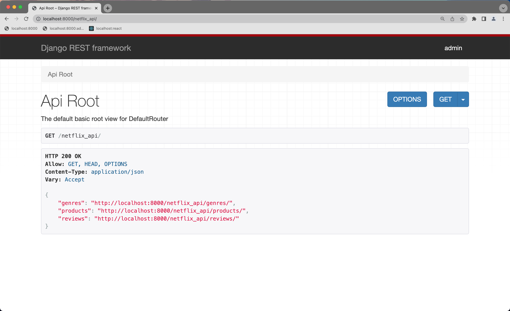
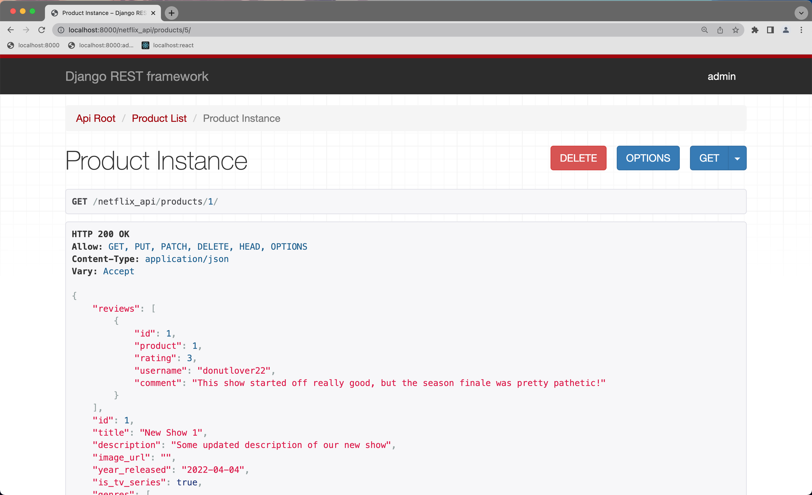
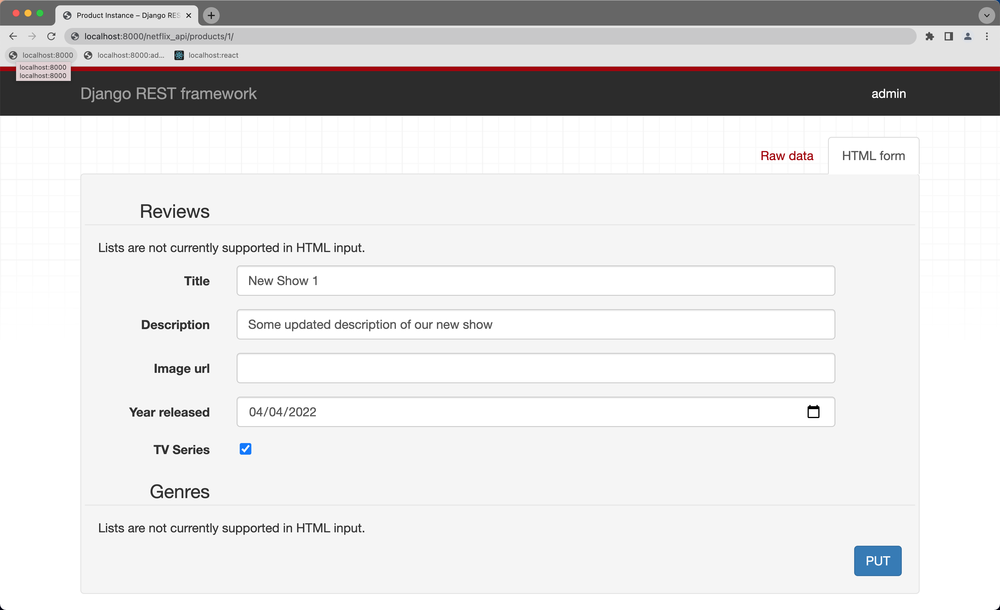

# Django Rest Framework

## Topics Covered / Goals
- Using Django as an API, with Django Rest Framework (DRF)
- Creating a React front-end to work with our API

## Lesson

Django has a lot of convenience built in for us to leverage. One great example from yesterday's tutorial was the (albeit *brief*) introduction to using ModelForm, which abstracts away data parsing and validation for us and makes our code more condensed and simpler to implement. But we initially started with manually parsing form data ourselves, because it is always important to know the process in case we're ever in a situation where something like ModelForm won't be enough for our needs. 

Today we're going to incorporate the Django Rest Framework (DRF) library into our Netflix Review API that we created with yesterday's tutorial. DRF is just another convenience layer built on top of the already-convenient Django layer. As we will see, DRF can make it MUCH quicker (and much easier) to create an API, compared to all the work that we had do yesterday. It is important to understand all of the steps required to set up an API back-end in Django, but we are now ready to move on to using other tools that do a lot of the hard work for us automatically. 

Let's learn about some tools that Django Rest Framework can provide us! (And with the time that we save using DRF, we might be able to get a React front-end app created to hit our Django API end-points! )

### Setting Up Django Rest Framework

#### Install

First, we'll need to install the Django Rest Framework library into our virtual environment:

```sh
$> source .venv/bin/activate

$> pip install djangorestframework
$> pip freeze > requirements.txt
```

#### Configure

Next, we have to update our project settings:

**settings.py**
```python
# netflix_proj/settings.py

INSTALLED_APPS = [
    # ...
    "netflix_app", 
    "rest_framework", # add this specific app name (not customizable)
]
```

And that's it! We'll all ready to use DRF features in out Django app!

### Updating Models (...but not really)

Our models do not change at all, despite using DRF features. However, one small additional we could make (for later use) is adding a very simple base model class in `models.py`:

**models.py**
```python
# netflix_app/models.py

# ...

class FieldNamesMixin: # new base class
    @classmethod
    def get_field_names(cls):
        return [field.name for field in cls._meta.get_fields()]


class CategoryModel(models.Model, FieldNamesMixin): # inherit from our new base class
    # ...

class GenreModel(models.Model, FieldNamesMixin):
    # ...

class ProductModel(models.Model, FieldNamesMixin):
    # ...

class ReviewModel(models.Model, FieldNamesMixin):
    # ...
```


### Updating Serializers / Using DRF ModelSerializer

While I'm sure it was *a ton of fun* for us to create our serializers from scratch in yesterday's tutorial, DRF provides a very quick and efficient tool for creating serializers, via ModelSerializer. Let's update our serializers using ModelSerializer, and compare this with what we had before:

**serializers.py**
```python
# netflix_app/serializers.py

from rest_framework import serializers
from .models import *


# Category serializers

class CategorySerializer(serializers.ModelSerializer):
    class Meta:
        model = Category
        fields = Category.get_field_names()

# class CategoryNestedSerializer(CategorySerializer):
#     def to_representation(self, instance): # overriding base method (must be named this)
#         self.fields["products"] = ProductSerializer(many=True)
#         return super().to_representation(instance)


# Genre serializers

class GenreSerializer(serializers.ModelSerializer):
    class Meta:
        model = Genre
        fields = Genre.get_field_names()

# class GenreNestedSerializer(GenreSerializer):
#     def to_representation(self, instance):
#         self.fields["products"] = ProductSerializer(many=True)
#         return super().to_representation(instance)


# Product serializers

class ProductSerializer(serializers.ModelSerializer):
    class Meta:
        model = Product
        fields = Product.get_field_names()
        fields.append("average_rating")
        
    average_rating = serializers.DecimalField(source="get_average_rating", max_digits=3, decimal_places=2, read_only=True)

# class ProductNestedSerializer(ProductSerializer):
#     def to_representation(self, instance):
#         self.fields["category"] = CategorySerializer()
#         self.fields["genres"] = GenreSerializer(many=True)
#         self.fields["reviews"] = ReviewSerializer(many=True)
#         return super().to_representation(instance)


# Review serializers
 
class ReviewSerializer(serializers.ModelSerializer):
    class Meta:
        model = Review
        fields = Review.get_field_names()

    def update(self, instance, validated_data):
        # silently prevent reviewed product and reviewer username from being updated
        validated_data.pop("product") 
        validated_data.pop("username")
        return super().update(instance, validated_data)

# class ReviewNestedSerializer(ReviewSerializer):
#     def to_representation(self, instance):
#         self.fields["product"] = ProductSerializer()
        
#         repr = super().to_representation(instance)
        
#         repr["comment"] = repr["comment"] or "This user did not provide a comment."
#         return repr
```

### Updating Views / Using DRF ModelViewSets

Oh, but this is the beginning of our DRF adventure! If you think we saved a lot of time implementing our serializers with DRF ModelSerializers, let's take a look at how DRF ModelViewSets make our view handlers so much more simpler to implement!

**views.py**
```python
# netflix_app/views.py

from rest_framework import viewsets
from .serializers import *

class CategoryViewSet(viewsets.ModelViewSet):
    queryset = Category.objects.all()
    serializer_class = CategorySerializer
    http_method_names = ["head", "get"] # only allow these request types

class GenreViewSet(viewsets.ModelViewSet):
    queryset = Genre.objects.all()
    serializer_class = GenreSerializer
    http_method_names = ["head", "get"]

class ProductViewSet(viewsets.ModelViewSet):
    queryset = Product.objects.all()
    serializer_class = ProductSerializer

class ReviewViewSet(viewsets.ModelViewSet):
    queryset = Review.objects.all()
    serializer_class = ReviewSerializer
```

That's it!! That's all the code we have to write to get the functionality of our view handlers from before! CRUD operations are so common that DRF developers built use viewsets to handle the majority of the work for us, so long as we tell the viewsets how to access the data (via the specified queryset) ad serializer the data (via the specified serializer_class). 

### Updating Urls / Using DRF DefaultRouter

We saw the ease of using viewsets for specifying views. We can also leverage viewsets to create routes for us, using a DRF Router object. Here's what we have to do to get our routes using DRF:

**app urls.py**
```python
# netflix_app/urls.py

from django.urls import path, include
from rest_framework import routers
from .views import *

r = routers.DefaultRouter()
r.register("categories", CategoryViewSet, basename="category") # url base, views, view name base
r.register("genres", GenreViewSet, basename="genre")
r.register("products", ProductViewSet, basename="product")
r.register("reviews", ReviewViewSet, basename="review")

urlpatterns = [
    path("", include(r.urls))
]
```

That was pretty easy, right? 

### DRF API View

Aside from providing many tools for our coding, DRF also provides one more additional bonus: A fully functioning browser front-end view to make API calls to our back-end (similar to Postman). And maybe the best part is that we don't have to do anything special to set it up. Let's launch our Django server, and see the API View in action:

```sh
python manage.py runserver
```

If we navigate to `http://localhost:8000/netflix_api/`, we'll hit our API View root page, which should look something like this:



And if we navigate to `http://localhost:8000/netflix_api/products`, we are brought to a page for sending requests to our back-end. It's pretty straightforward to use... similar to using Postman. 





### Django Rest Framework Summary

As we've seen here today, Django Rest Framework cuts the amount of code (and thus, amount of time) we developers have to write for creating an API back-end using Django. It is important to know that we can mix-and-match parts of DRF functionality with standard Django functionality. For example, we could use ModelSerializers without using ModelViewSets (our original code would need to change a bit to accommodate such a combination). We could also use default routes created by the DefaultRouter and/or add in additional custom routes & view handlers for our project. 

There's more Django Rest Framework has to offer than what we've covered, but will leave that for you to discover by being good developers (i.e: looking up examples and reading documentation)!


## External Resources
- [Django Rest Framework](https://www.django-rest-framework.org/tutorial/quickstart/)

## Assignments
- Go over today's tutorial yourself!
- [Update School API using DRF](https://github.com/romeoplatoon/django-school-api)

