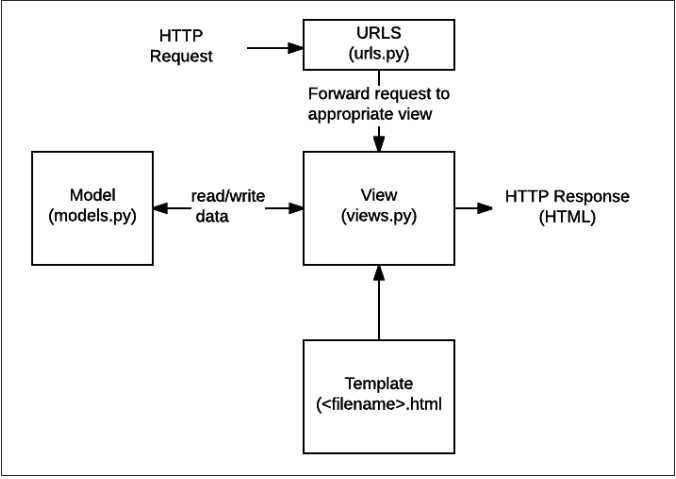

# Django Polls App


## Topics Covered / Goals
- Install and setup Django within a virtual enviornment
- Practice creating a database and models
- Add views to a simple Django app and understand its underlying structure
- Use Django forms to allow users to interact with your app

## Lesson
**Introduction to Django**

Django is the web framework for Python. As we've mentioned before, a library is nothing more than thousands of lines of code that someone else wrote ahead of time to make your job as a developer easier. A framework is merely a bunch of libraries woven together. In today's web, we generally have a framework taking care of the backend (e.g., Django, Rails, Node) and a framework taking care of the frontend (e.g., React, Angular, Backbone). Fullstack solutions like Ruby on Rails and Django are available, but are too slow for the modern web user.

Today, we're going to get started with using Django as a full stack framework, handling both the front and back end of our application. Later, we'll learn how to run Django just as an API (backend) layer and use it in conjunction with React on the frontend.

**Setup**

This tutorial is largely based off of [the official docs](https://docs.djangoproject.com/en/3.1/intro/tutorial01/). A few things have been removed for brevity and others have been added to account for our current level of knowledge.

First things first for any new Django project, we need a new virtual environment to keep our dependencies isolated to this project and the versions we build it with.

> **NOTE**: This will become a repetive workflow for setting up a new project.

1. Create a Python Virtual Environment: `python -m venv ~/venvs/polls_env`
2. Activate your `venv`:
  On Mac/Linux 
  > `source ~/venvs/polls_env/bin/activate`

  On Windows 
  > `~\venvs\polls_venv\Scripts\activate`

3. Install `django` into your environment: `pip install django`
4. Create a Django project called `polls_project`: `python -m django startproject polls_project`


*Let's fire up the server:* `python manage.py runserver`. Next, visit http://localhost:8000 and see what you get!

*Don't worry about any unapplied migrations yet. We're not using our database just yet.*


**Poll App / Views**

Now the server will continue running until you stop it with Ctrl-C, but that means you can't use the command line. So to continue running commands, open a second terminal window. In the same directory / level as `manage.py`, run:

```bash
source ~/venvs/polls_env/bin/activate
python manage.py startapp polls_app
```

A quick sidebar - we ran `startproject` earlier and we are now running `startapp`. The difference between these two is that a `project` consists of many `apps`.

In `polls_app/views.py`, let's put the following code inside:
```python
from django.shortcuts import render
from django.http import HttpResponse

def index(request):
    return HttpResponse("Hello, world. You're at the polls index.")
```

We created a request method called `index` inside the `views` file. Next, we need to register this page in `polls_app/urls.py` *(you need to create this file)*. Create that file and paste the following code in there:

```python
from django.urls import path

from . import views

urlpatterns = [
    path('', views.index),
]
```

Finally, we will connect our recently created `urls.py` to `polls_project/urls.py`. *Delete the code that is already in the `urls.py` file and replace it with the code below*:

```python
from django.urls import include, path

urlpatterns = [
    path('polls/', include('polls_app.urls')),
]
```

Whoa, a lot of code just now - let's break it down. We started off earlier with creating a project called `polls_project`. Projects can consist of many apps. We then created a `polls_app` app which is at the same level as `polls_project`. Whenever anyone hits any route (aka endpoint) with `/polls`, the `polls_project/urls.py` file will direct them to the `polls` app, specifically the `urls` file. From there, it'll send the user to `index` method in `views.py`.

In `polls_app/urls.py`, let's break down the `path` method that we imported. `path` takes in 4 arguments. 2 of them are required and 2 of them are optional. In order, they are `route`, `view`, and `kwargs` / `name`. `route` is the path that you enter in the URL. `view` is the file that handles the logic behind what shows up on your screen. `views.index` means "Look at the index method in the `views.py` file." 

Visit http://localhost:8000/polls to see what you get!

**Setting up our Database**

We are going to use Postgres for our database.

Let's ensure that the `ENGINE` reads `'ENGINE': 'django.db.backends.postgresql'` in `polls_project/settings.py` before moving on.


**Models & Migrations**

Django's architecture is based off the MVC pattern - Model, View, Controller. The Controller layer (`views.py`) can be seen as the brains of the app - it handles the logic . The View layer (`templates/`) is responsible for everything that a user sees, and the Model layer (`models.py`) is what connects your Python objects to the database. As you're starting to see, everything that we have been teaching has led to us writing this framework code.

| MVC Framework | Django  |
|---|---|
| Model  | `models.py`  |
| View  |  Template folder (`templates/{app_name}/example.html`) |
| Controller  | `views.py`  |

This might seem a little confusing at first because Django has something called 'views', which are used to represent the Controller in MVC, not the View.



In Django, we declare all of our models in one file: `models.py`. In polls_app/models.py, let's write:

```python
from django.db import models

class Question(models.Model):
    question_text = models.CharField(max_length=200)
    pub_date = models.DateTimeField('date published')

class Choice(models.Model):
    question = models.ForeignKey(Question, on_delete=models.CASCADE)
    choice_text = models.CharField(max_length=200)
    votes = models.IntegerField(default=0)
```

We've got two tables in our polls app: question and choice. A question has `question_text` and a `pub_date`, and has many choices. A choice belongs to a question through the `question = models.ForeignKey(Question, on_delete=models.CASCADE)`, has `choice_text` and `votes`.

Next, we have to hook up our polls app to `polls_project`'s configuration in `polls_project/settings.py`:
```python
INSTALLED_APPS = [
    'polls_app',
    'django.contrib.admin',
    'django.contrib.auth',
    'django.contrib.contenttypes',
    'django.contrib.sessions',
    'django.contrib.messages',
    'django.contrib.staticfiles',
]
```

Now we're ready to migrate our database schema to reflect our models in `models.py`:
```bash
python manage.py makemigrations
```

A new file was created for us: `polls_app/migrations/0001_initial.py`. Every time that you run `python manage.py makemigrations`, it will detect differences and save it as a numbered migration under your `migrations` folder. This allows you to store changes to your models and ultimately your database schema over time.

Finally, to get our code into the database:
```bash
python manage.py migrate
```

**Playing with the Django shell**

```
python manage.py shell
```
This gives us access to the Python shell, but with our entire app loaded into it! We can interact with the database using Python code:

```python
from polls_app.models import Question
Question.objects.all() # should return an empty collection, which makes sense since we have nothing in the database yet. Let's create a question record.

from django.utils import timezone
question = Question(question_text="What's new?", pub_date=timezone.now())
question.save()
question.id
question.question_text
question.pub_date

## If you want to change the attributes, go ahead and overwrite them, then call save()
question.question_text = 'What is up?'
question.save()

## Now if you wanted to get all the questions
Question.objects.all()
```

You'll notice that the result we get back (`<Question: Question object (1)>`) is not descriptive. In `polls_app/models.py`, we are going to add a `__str__` method in for Question and Choice. All dunder methods are built in to Django; the dunder `str` method is a method we're going to overwrite so that we get a better description of each object.

```python
## polls/models.py
from django.db import models

class Question(models.Model):
    question_text = models.CharField(max_length=200)
    pub_date = models.DateTimeField('date published')
    
    def __str__(self):
        return f"ID: {self.id} Question Text: {self.question_text}"

class Choice(models.Model):
    question = models.ForeignKey(Question, on_delete=models.CASCADE)
    choice_text = models.CharField(max_length=200)
    votes = models.IntegerField(default=0)
    
    def __str__(self):
        return f"ID: {self.id} Choice Text: {self.choice_text}"
```

Fire up a new console and run some commands. A bunch of commands can be found [here](https://docs.djangoproject.com/en/3.1/topics/db/queries/):

```python
Question.objects.all() # note how you get a much more descriptive representation than what you got before

question = Question.objects.get(id=1)
question.choice_set.all() # verifying that we have no choices for our questions
```

What is `choice_set`? This is how django lets you access one model from another, related model. Django creates this name automatically based on the name of the model (e.g. f"{model_name}_set"). Like many default settings in Django, it's possible to configure the name of this property by setting a "related_name" in the model, if you want to call it something else, like `choices`. 

```python
question.choices.all() # verifying that we have no choices for our questions
## Let's create 3 choice objects that are linked to our question variable
question.choices.create(choice_text='Not much', votes=0)
question.choices.create(choice_text='The sky', votes=0)
choice = question.choices.create(choice_text='Just hacking again', votes=0)

## Now we can go from a question to a choice and vice versa
question.choices.all()
choice.question
```

**Additional Views**

We're going to add 3 new routes:
- `/polls/:question_id` (view a particular question)
- `/polls/:question_id/results` (view the results of that particular question)
- `/polls/:question_id/vote` (vote on the choices on that question)

In `polls/urls.py`, let's register these routes and their corresponding methods:
```python
from django.urls import path
from . import views

urlpatterns = [
    # ex: /polls/
    path('', views.index, name='index'),
    # ex: /polls/5/
    path('<int:question_id>/', views.detail, name='detail'),
    # ex: /polls/5/results/
    path('<int:question_id>/results/', views.results, name='results'),
    # ex: /polls/5/vote/
    path('<int:question_id>/vote/', views.vote, name='vote'),
]
```

Next, create the following methods in `polls/views.py`:
```python
from django.http import HttpResponse
from django.shortcuts import render

def index(request):
    return HttpResponse("Hello, world. You're at the polls index.")

def detail(request, question_id):
    return HttpResponse(f"You're looking at question {question_id}.")

def results(request, question_id):
    return HttpResponse(f"You're looking at the results of question {question_id}.")

def vote(request, question_id):
    return HttpResponse(f"You're voting on question {question_id}.")
```
Visit those routes with `question_id` as 1 and see what you get!

**Templating**

Of course, having plain text is not terribly useful. We want to create templates in HTML (the View layer of MVC) where we can pass in Python objects of data. Under your `polls_app` directory, create a `templates` folder, and under that directory, create another `polls_app` folder, and under that directory create an `index.html` file:

```html
<!-- polls/templates/polls/index.html -->
<h1> All Polls </h1>

  <ul>
    
      <li><a href="/polls/{{ question.id }}/">{{ question.question_text }}</a></li>
    
  </ul>

  <p>No polls are available.</p>

```

```html

{{ print statements }}
{# comments #}
```
Next, we'll update the def `index` view in `polls/views.py` to send a dictionary to our new template. The method `render()` requires a dictionary and is used to send `latest_question_list` to be displayed by our markup at `polls/index.html`:
```python
from django.shortcuts import render
from django.http import HttpResponse
from .models import Question

def index(request):
    latest_question_list = Question.objects.order_by('-pub_date')
    data = { 'latest_question_list': latest_question_list }
    return render(request, 'polls_app/index.html', data)

def detail(request, question_id):
    return HttpResponse(f"You're looking at question {question_id}.")

def results(request, question_id):
    return HttpResponse(f"You're looking at the results of question {question_id}.")

def vote(request, question_id):
    return HttpResponse(f"You're voting on question {question_id}.")
```


If you were to visit http://localhost:8000/polls, you'd see all of the questions we've written thus far. Let's move onto the detail function in our `polls/views.py` file which will be `/polls/1` page:

```python
from django.shortcuts import render
from django.http import HttpResponse
from .models import Question

def index(request):
    latest_question_list = Question.objects.order_by('-pub_date')
    data = { 'latest_question_list': latest_question_list }
    return render(request, 'polls/index.html', data)

def detail(request, question_id):
    question = Question.objects.get(id=question_id)
    data = { 'question': question }
    return render(request, 'polls/detail.html', data)

def results(request, question_id):
    return HttpResponse(f"You're looking at the results of question {question_id}.")

def vote(request, question_id):
    return HttpResponse(f"You're voting on question {question_id}.")
```

In our **`polls/templates/polls`** directory create a file called `detail.html`:

```html
<h1> Details about Question {{ question.id }} </h1>
<h2> {{ question.question_text }} </h2>
<ul>
  
    <li>{{ choice.choice_text }}</li>
  
</ul>
```


**Forms in Django**

Let's create a form so that people can vote on a question. In `polls_app/templates/polls_app/detail.html`, put the following code:

```html
<h1> Details about Question {{ question.id }} </h1>
<h2> {{ question.question_text }} </h2>

<p><strong>{{ error_message }}</strong></p>

<form action="/polls/{{ question.id }}/vote" method="POST">
  
  
    <input type="radio" name="choice" id="choice{{ forloop.counter }}" value="{{ choice.id }}">
    <label for="choice{{ forloop.counter }}">{{ choice.choice_text }}</label><br>
  
  <input type="submit" value="Vote">
</form>
```
There are a few things to note with this form:
1. We are outputting error messages if they are present
2. We are explicitly declaring that the method for our form is `POST` because we are _sending_ information
3. We're creating a bunch of radio button options in one loop to account for each `choice` for our `question`. Each radio button has an unique `id` using `forloop.counter` (comes for free with Python)

If you refresh your page (`/polls/1`), you'll see your choices come on the screen. Submit it and you'll be directed to a page that simply says "You are voting on question 1". That's because we haven't accounted for the `POST` request in our code yet. If you look in your `urls.py`, you'll see that we defined the route but the action in `views.py` isn't really doing anything yet. We need to fix that up!

```python
## polls/views.py
from django.http import HttpResponse, HttpResponseRedirect
from django.shortcuts import render
from django.urls import reverse

from .models import Question, Choice

def get_question(question_id):
  # this is a helper method we've created since we need to find the question in detail(), results(), and vote()
  return Question.objects.get(id=question_id)

def index(request):
    latest_question_list = Question.objects.order_by('-pub_date')
    data = { 'latest_question_list': latest_question_list }
    return render(request, 'polls_app/index.html', data)

def detail(request, question_id):
    question = get_question(question_id)
    return render(request, 'polls_app/detail.html', {'question': question})

def results(request, question_id):
    return HttpResponse(f"You're looking at the results of question {question_id}.")

def vote(request, question_id):
    question = get_question(question_id)
    try:
        selected_choice = question.choices.get(pk=request.POST['choice'])
    except (KeyError, Choice.DoesNotExist):
        return render(request, 'polls_app/detail.html', {
            'question': question,
            'error_message': "You didn't select a choice.",
        })
    else:
        selected_choice.votes += 1
        selected_choice.save()
        return HttpResponseRedirect(f'/polls/{question_id}/results')
```

We've rewritten a lot of code. Let's break down the differences:

```python
from django.http import HttpResponse, HttpResponseRedirect # brings in the ability to redirect the user
from django.shortcuts import render
from django.urls import reverse # The reverse library gives us the ability to read the previous URL and just use reverse in our code so that we don't need to hard code the URL

from .models import Question, Choice # bring in the Choice model because we need it to talk to the DB

def vote(request, question_id):
    question = get_question(question_id)
    try: # try to do this
        selected_choice = question.choices.get(pk=request.POST['choice']) # find the choice that the user submitted in the form
    except (KeyError, Choice.DoesNotExist): # couldn't find the selected_choice above will raise an error. using "except" will catch that error from blowing up the app
        return render(request, 'polls_app/detail.html', { # re-display the question voting form
            'question': question,
            'error_message': "You didn't select a choice.", # these two are local variables that the view needs. this "error_message" is specifically for that
            # <p><strong>{{ error_message }}</strong></p> line of code
        })
    else:
        selected_choice.votes += 1 # add 1 to the number of votes for that selected choice
        selected_choice.save() # save it to the database
        return HttpResponseRedirect(f'/polls/{question_id}/results')
        # Always return an HttpResponseRedirect after successfully dealing
        # with POST data. This prevents data from being posted twice if a
        # user refreshes the page.
```

When we vote, we get redirected to the results page which just has some text in it. Let's alter that:
```python
## polls/views.py
def results(request, question_id):
    question = get_question(question_id)
    return render(request, 'polls_app/results.html', {'question': question})
```
`results` is telling us to create a `results.html` file in our `polls_app/templates/polls_app` directory:
```html
<h1> Details about Question {{ question.id }} </h1>
<h2> {{ question.question_text }} </h2>

<ul>
  
    <li>{{ choice.choice_text }} -- {{ choice.votes }} vote{{ choice.votes|pluralize }}</li>
  
</ul>
<a href="/polls/{{ question.id }}/detail">Vote again?</a>
```


## External Resources
[the official django tutorial](https://docs.djangoproject.com/en/3.1/intro/tutorial01/)

## Assignments
- [Cars and Brands](https://github.com/sierraplatoon/django-cars-and-brands)


