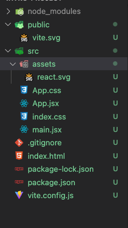

# Intro to React

## Topics Covered / Goals
- Creating a React application
- Using JSX in React
- Creating React components
- Using state and prop values in components

## Lesson

### React Introduction

> React is a front-end framework that was developed by Facebook in 2012 and open-sourced in 2013. React is based on the idea of building reusable components -- this leads to mixing markup with functional logic. This is accomplished through React's hybrid syntax, JSX, which we will dive deeper into later. Up to this point, our views have been relatively simple, and most of the heavy lifting has been done on the back-end with django. With React, it'll be easier to do complex logic and state management on the front-end. 

> Before we just dive right into writing React code, let's get a quick overview of what react is, and how to work with it

#### React Slides

- [Intro React Slides](https://docs.google.com/presentation/d/1M-v9JHc3DkdPIVDClBvMbrenVyFPJm890aK7QvVjQ48/edit#slide=id.g195c3bc0cd1_0_84)

> React is the most popular front end framework in North America, but there are several popular options, such as Angular, Vue, and Svelte.

> Django helped us build MVC applications, where django templates served as the view. Now, we'll no longer be using django templates, and instead we'll use react for our views. 

> React.js by itself is not such a large and complicated library, but it is the center of a complex ecosystem, made up of many other scripts and tools, some of which will get bundled with react itself when we create our first react app today. The first one we'll see will probably be `react-dom`, which is used specifically for interacting with the DOM in browsers. This functionality would be included in React.js itself, but React can actually be used to render views in platforms that don't use the DOM, like mobile devices or 3D scenes, so it makes sense to put DOM manipulation in a separate package. 

##### Webpack
> Two more important tools we'll want to use with react are webpack and babel. As we build our react app, we'll want to organize it into many smaller files that import each other, similarly to how we built our back end with django. However, we can get better performance if our server sends only a few, large, minified files, instead of many smaller files. Webpack will allow us to write our app in an organized way, and then automatically bundle the files together.

##### Babel
> There are many advanced features of javascript that we might want to use in our application that are not yet supported in all browsers. There are also features we want to use in our application that are not natively supported by any browser, such as JSX. Babel is a tool that allows us to write javascript in whatever style we prefer, and then have it automatically converted into a style that all browsers can understand. 

##### create-react-app (CRA)
> Both webpack and babel are fairly complex to configure, but fortunately there are other tools that can abstract away this complexity for us. Create-react-app is a popular npm library that will help us scaffold a react project, similarly to using `django-admin startproject mysite`.

##### Vite
> For this class we will be using a tool called Vite (which means 'fast' in french). This tool will take care of building and managing our app in a quicker and more efficient manner. Similar to create-rect-app it will scaffold a react project for us and give us a dev server to use. 

##### Components
> A defining feature of react applications is the use of component-based architecture. We'll use JSX to write components, and we'll use our components to compose complex applications. The JSX in our components looks like snippets of HTML, but it's actually a syntax extension of javascript. 


### First React App

> Let's get started creating our first React app! Let's run the following commands in our terminal:
```sh
npm create vite
```
> You will then be prompted to enter a project name then select a framework. 
> We will be selecting react.
Once that's done, run:
```
cd vite-project
npm install
npm run dev
```
It's that simple! If everything was set up correctly, you should now have a React server running on port 5173 (default) and a browser should have popped open to a page (http://localhost:5173/) that should look something like this:


This is the default React application rendered view. Now let's go look at the file structure that was created when we created our React app.  



There are a few folders and files we should know about:
- ```node_modules/``` = this folder contains all of the downloaded React libraries
- ```src/``` = this folder contains all of the files for our React logic
  - ```main.jsx``` = the main entry point into our application logic
  - ```index.css``` = the main styling for our app's general compnents (fonts, )
  - ```App.jsx``` = the root component in our React application
  - ```App.css``` = the main styling for our React application
- ```index.html``` = the main html file for our application
- ```package.json``` = the additional libraries that we're using for our React application (which is similiar to our Django project's "requirements.txt" file)

You should never have to modify anything in the ```node_modules/``` folder. 

### The "new" React/JSX way

JSX is essentially an intermediary language syntax that allows us to write JavaScript code inside of HTML syntax. This is the same sort of functionality that Django templating syntax offered us when we were working in Django, allowing us to insert Python code into HTML templates. JSX code boils down to become JavaScript code behind the scenes. To insert JS logic in JSX code blocks, we use curly braces `{` `}`, and write JS expressions inside of those blocks. There is some limitation to what JS code we can write with in these blocks, but we'll explore this more later on.


We generally start our modifications in ```src/App.js```. Let's modify our ```App.jsx``` to look like this:

```javascript
// App.jsx

import './App.css';

function App() {
  return (
    <div className="App">
      <h1>Hello World!</h1>
    </div>
  );
}

export default App;
```

The nice thing about the React server is that it'll automatically refresh when changes are detected. Our page should how display "Hello World!". 

**NOTE:** Windows users might have to enter this command to get hot reloading (updating as files change) to work: `export CHOKIDAR_USEPOLLING=true`. I'd uncomment/add this in your `.bashrc` so that you don't have to do it every time you start a container.

> JSX makes it MUCH easier to implement DOM changes dynamically, because we essentially will be writing the HTML that we want to create, inside of our JavaScript file. Let's take a look at creating a simple counter example:

```javascript
// App.jsx

// styling
import './App.css';

// react
import { useState } from "react"

function App() {
  // states
  const [counter, setCounter] = useState(0)

  // event handlers
  const incrementCounter = () => {
    setCounter(counter + 1)
  }

  // render
  return (
    <div className="App"> {/* important: we must always return ONE parent element */}
      <h2 id="my-header">My Button Click Counter App</h2>
      <button id="my-button" onClick={incrementCounter}>Click Me!</button>
      <p id="my-output">You've clicked the button {counter} times.</p>
    </div>
  )
}

export default App; 
```

**IMPORTANT:** A component must always return at most ONE parent element. If you try to return multiple top-level elements, you'll get an error! That's why we've wrapped our button and paragraph elements with a parent div element. 

We've introduced a lot of new items here, so let's unpack it all so that we understand React a little better...


### State Values

React has some magic going on behind the scenes to manage the rendering for our application. As we noted above, the React server will automatically refresh our view when it detects any relevant changes. However, we need to use the appropriate logic so that React will know when something changes. This is the purpose behind using state values. State values are values that are internal to a component, managed by React. In the code snippet above, we created a state value using the ```useState()``` hook. We need to import this hook (i.e. function that hooks into React logic) from the React library:

```javascript
  import { useState } from "react"
```

The ```useState()``` hook function takes in one value, and returns two values:
- INPUT: Initial value for your state value... ```0```
- OUTPUT: The state value, and a function to update the state value... variables: ```counter, setCounter```

```javascript
  const [counter, setCounter] = useState(0) // sets initial value of counter to 0, and returns an updating function for that value
```

**IMPORTANT:** DO NOT MANUALLY UPDATE STATE VALUES DIRECTLY!!!

For our example, we should **always** use the ```setCounter()``` function if we ever need to update the value of ```counter```. This is because React needs to know when our state value is updated, and the ```setCounter()``` function will accomplish this. If we were to update ```counter``` directly ourselves, the value would still change, however React would not know that it's changed, and therefore React will not update our rendered view automatically. If we want to see what problems can occur by updating state values directly, we can try the following modified example:

```javascript
  const incrementCounter = () => {
    counter = counter + 1 // updating a state value directly == BAD!!!
    console.log(counter) // prints out the correct updated value, but our rendered output never updates!
  }
```

While we *can* update values directly without getting an error, we should NEVER update state values directly, as highlighted by the example above. Instead of updating values directly, we should use the state updating function that is returned from ```useState()``` (e.g. ```setCounter``` from our example) 

> One last important thing to mention is that state updates in React are applied **asynchronously**. In other words, our React app will **eventually** apply the new state value that we specify via the state updating function. We can see this if we add in a ```console.log(counter)``` line in our ```incrementCounter()``` function:

```javascript
  const incrementCounter = () => {
    setCounter(counter + 1)
    console.log(counter) // this is still the previous value!
  }
```

Notice how the printed value lags the correct value of ```counter``` by one. Again, this is because the update doesn't take effect immediately! This is something you need to keep in mind, because it can often trip up developers. To answer the question of "When can I know once a state value has been updated (in case I need to respond to it)?", we'll need to learn about the React Component Lifecycle. We'll cover this in a future lecture. 


#### Multiple State Updates

The new code for `incrementCounter` above works for updating our rendering, but it can be improved. To highlight the "problem" that can arise, let's change our code to be this:

```javascript
  const incrementCounter = () => {
    setCounter(counter + 1)
    setCounter(counter + 1)
    setCounter(counter + 1)
    setCounter(counter + 1)
    setCounter(counter + 1)

    // counter will only increment once!
  }
```

What do you think the value of counter will be onces React updates our render? Again, keep in mind that state value updating is asynchronous in React, so this might not do what you expect. We're using the *old* value of `counter` for each update. This means that all 5 lines of code in our function will be setting the same state value... the current "old" value of `counter` plus one. If we want to do this correctly (short of just adding 5 to the counter) with multiple `setCounter` calls, the correct way would be to use a function that will accept the previous "new" value and use that to set the next "new" value for `counter`:

```javascript
  const incrementCounter = () => {
    setCounter(prevCounter => prevCounter + 1) // gets passed the previous NEW value from any previous update (or the current value), and returns the updated NEW value
    setCounter(prevCounter => prevCounter + 1) // ditto
    setCounter(prevCounter => prevCounter + 1) // ditto
    setCounter(prevCounter => prevCounter + 1) // ditto
    setCounter(prevCounter => prevCounter + 1) // ditto

    // counter will increment 5 times (once for each call)
  }
```

As we've seen, the `setCounter` updating function can take in a new state value, *or* a function that accepts a previous state value and returns a new state value! 

### Components

In the code snippet above, `App()` is a React *component*. A component essentially can be thought of as our own custom HTML element. A component must return JSX, which will be used by React to create/update elements for the DOM, a.k.a. rendering the DOM. This is the simplest component that we can create:

```javascript
function App() { // name of component
  return (
    // insert JSX for what you want to be rendered by React to the screen
  )
}

export default App;
```

A full React application will generally contain multiple nested components, each of which should be given their own individual files. To use a component in JSX, we simply use HTML syntax to have it be rendered. Suppose we've created a new component called `MyCustomComponent` in a .js file. We can render it in this manner:

- **components/MyCustomComponent.jsx**
```javascript
// MyCustomComponent.jsx

function MyCustomComponent() {
  return (
    <h2>Hello World!</h2>
  )
}

export default MyCustomComponent;
```

- **App.jsx**
```javascript
// App.jsx

// components
import MyCustomComponent from "./components/MyCustomComponent.jsx"

function App() {
  return (
    <MyCustomComponent /> // rendering our new component, inside of another component
  )
}

export default App;
```

Components allow for easy reusability of logic in React. To see this in action, let's say we want to have multiple button counter instances in our application. Let's create a new component called `ButtonCounter` and relocate some logic from our `App` component:

- components/ButtonCounter.js

```javascript
// ButtonCounter.jsx

// react
import { useState } from "react"

function ButtonCounter() {
  // states
  const [counter, setCounter] = useState(0)

  // event handlers
  const incrementCounter = () => {
    setCounter(counter + 1)
  }

  // render
  return (
    <div>
      <button id="my-button" onClick={incrementCounter}>Click Me!</button>
      <p id="my-output">You've clicked the button {counter} times.</p>
    </div>
  )
}

export default ButtonCounter;
```

- App.jsx

```javascript
// App.jsx

// styling
import './App.css';

// components
import ButtonCounter from "./components/ButtonCounter.jsx"

function App() {
  // render
  return (
    <div className="App">
      <h2 id="my-header">My Button Click Counter App</h2>
      <ButtonCounter />
      <ButtonCounter />
      <ButtonCounter />
    </div>
  )
}

export default App;
```


### Prop Values

Now that we've learned about component state values, let's learn about prop values. Prop ("property") values are values that are passed down to a component, from a parent component. They are akin to providing attribute values to an HTML element, or passing arguments to a function call. To see prop values at play, we'll have to modify our example and include a few more components: 

- **components/ButtonCounter.js**
```javascript
// ButtonCounter.jsx

// react
import { useState } from "react"

// components
import MyButton from "./MyButton.jsx"
import MyOutputLabel from "./MyOutputLabel.jsx"

function ButtonCounter() {
  // states
  const [counter, setCounter] = useState(0)

  // event handlers
  const incrementCounter = () => {
    setCounter(prevCounter => prevCounter + 1)
  }

  // render
  return (
    <div>
      <MyButton handleClick={incrementCounter} /> {/* new component, taking in a prop value of handleClick */}
      <MyOutputLabel myValue={counter} /> {/* new component, taking in a prop value of myValue */}
    </div>
  )
}

export default ButtonCounter;
```

- **components/MyButton.jsx**
```javascript
// components/MyButton.jsx

function MyButton(props) { // notice that we take in a parameter for our functional component, which is an object that captures ALL props that are passed down
  // render
  return (
    <div>
      <button id="my-button" onClick={props.handleClick}>Click Me!</button> {/* access items from props */}
    </div>
  )
}

export default MyButton;
```

- **components/MyOutputLabel.jsx**
```javascript
// components/MyOutputLabel.jsx

function MyOutputLabel(props) { // accept "props" object as the first parameter
  // render
  return (
    <div>
      <p id="my-output">You've clicked the button {props.counter} times.</p> {/* access items from props */}
    </div>
  )
}

export default MyOutputLabel;
```

We've split up our functionality into different components. Our new `MyButton` component handles the input mechanism, and our new `MyOutputLabel` component handles the output mechanism. Our parent component `ButtonCounter` manages the shared data, in this case the value of `counter`. We pass down a prop value down to `MyButton`, that allows `MyButton` to notify that parent of when the button was clicked. We pass down a prop value to `MyOutputLabel` to give it information for the output display. When either a prop value or state values changes, React will automatically trigger a re-render.

**IMPORTANT:** DO NOT MANUALLY UPDATE PROP VALUES DIRECTLY!!!

Much like state values, we should never updated prop values directly or bad things will happen! React is managing our state and prop values, so that whenever they change, React will know to trigger a re-render. But we must tell React when they change:
- state values should only be updated by the updating function returned from `useState()`
- prop values should not be updated by child components

### More Complex Rendering

Our component JSX code can get quite complicated sometimes. We should often opt to create new functions that are called from our component's render logic, to keep things organized. Take a look at the example below:

- **components/MyOutputLabel.jsx**
```javascript
// components/MyOutputLabel.jsx

function MyOutputLabel(props) { // accept "props" object as the first parameter
  // render
  const renderOutput = () => {
    console.log(">> internal counter value: ", props.counter)

    if (counter == 0) {
      return "You haven't clicked the button yet!"
    }
    
    const maxCount = 10
    if (counter > maxCount) {
      return `You've clicked the counter more than ${maxCount} times. I'm not counting anymore.`
    }

    return `You've clicked the button ${props.counter} times.`
  }
  
  return (
    <div>
      <p id="my-output">{ renderOutput() }</p> {/* calling a function here */}
    </div>
  )
}

export default MyOutputLabel;
```

### More Complex State Updating

**IMPORTANT:** DO NOT MANUALLY UPDATE STATE AND PROP VALUES DIRECTLY!!!

It gets slightly more tricky to update non-primitive data types, but nothing that we can't handle. Just remember that we should never be updating state (and prop) values directly. So what do we do if we have an array as a state value?

```javascript

import { useState } from "react"

function App() {
  // states
  const [myData, setMyData] = useState([5, 3, 2])

  // event handlers
  const appendData = () => {
    let newNum = Math.floor(Math.random() * 20)
    let newData = myData
    newData.push(newNum)

    setMyData(newData) // why won't this work? (render doesn't update properly)
  }

  // render
  const renderData = () => {
    let elements = []
    for (let i = 0; i < myData.length; i++) {
      elements.push(<li key={`${i}`}>myData[i]</li>)
    }

    return elements
  }

  return (
    <ul>
      { renderData() }
    </ul>
  )
}
```

The code above won't behave the way we intend. Can you guess why?

Answer: We're modifying our state value (`myData`) when we push our new number into `newData`. Note that `newData = myData` doesn't actually create a brand new copy of our original value!! We need to create an actually brand new copy of our data locally, modify it, and then pass it along to our state updating function, like this:

```javascript
  const appendData = () => {
    let newNum = Math.floor(Math.random() * 20)
    let newData = [...myData, newNum] // use the magic spread operator!

    setMyData(newData) // this works! (render updates properly)
  }
```


## External Resources
- [React Docs and Tutorials](https://reactjs.org/docs/getting-started.html)

## Assignments
- [Vowels](https://github.com/sierraplatoon/react-vowels) 
- [Detention](https://github.com/sierraplatoon/react-detention)
- [State Abbreviator](https://github.com/sierraplatoon/react-state-abbreviator)


