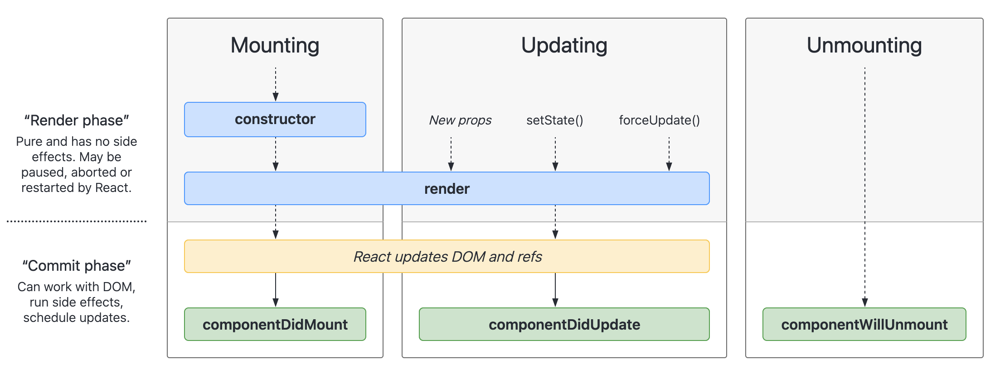

# News Site III

## Topics Covered / Goals
- Component Lifecycle
  - Each React component has a lifecycle and understanding the component lifecycle will help you understand the data flow in your app.
  - Lifecycle methods determine what is executed at what time in the component's lifecycle.
- React hooks (like useEffect) are the new way to implement lifecycle methods into functional components.
- Continue to build upon News Site project


## Lesson

Today, we're going to be learning the React Component Lifecycle, and to understand this better, we'll first be using class-based components (and then later moving back to functional components) 

**Component Lifecycle**
Let's talk through a concept called the "Component Lifecycle" for React. Below we are start with a component in its natural state:

`App.js`
```javascript
import './App.css';
import { Component } from "react"

class App extends Component {
  // render
  render() {
    return (
      <div className="App">
        <h2>Lifecyle App</h2>
      </div>
    );
  }
}

export default App;
```

Let's add some functionality, and add in a `Something` component that will be created/updated/destroyed inside of our application:

### Component Creation (componenetDidMount())

`App.jsx`
```javascript
import './App.css';
import { Component } from "react"
import Something from './components/Something';

class App extends Component {

  // render
  render() {
    return (
      <div className="App">
        <h2>Lifecycle App</h2>
        <hr />
        <Something />
      </div>
    );
  }
}

export default App;
```

`components/Something.jsx`
```javascript
import { Component } from "react"

class Something extends Component {
  
  // effects
  componentDidMount() {
    console.log("componentDidMount: I AM ALIVE NOW!")
  }

  // render
  render() {
    return (
      <div>
        This is something
      </div>
    )
  }
}

export default Something;
```

> If we check our console in the browser we might notice that the our app logs twice. Our component will only mount once but the `<React.StrictMode />` component in `main.jsx` causes this behavior. `StrictMode` puts additional checks on our application while developing to detect unexpected side effects 
[StrictMode docs](https://reactjs.org/docs/strict-mode.html#detecting-unexpected-side-effects)


### Component Destruction (componentWillUnmount())


`components/Something.jsx`
```javascript
class Something extends Component {
  
  // effects
  componentDidMount() {
    console.log("componentDidMount: I AM ALIVE NOW!")
  }

  componentWillUnmount() {
    console.log("componentWillUnount: I AM DYING NOW!")
  }

  // render
  render() {
    return (
      <div>
        This is something
      </div>
    )
  }
}
```


`App.jsx`
```javascript
class App extends Component {

  state= {
    exists:false,

  }

  // render
  render() {
    return (
      <div className="App">
        <h2>Lifecycle App</h2>
        <hr />
        <button onClick={() => this.setState({exists: true})}>Create</button>
        <button onClick={() => this.setState({exists: false})}>Delete</button>
        
        
        <Something />
      </div>
    );
  }
}

export default App;
```


### Component Update (componentDidUpdate())

`App.js`
```javascript
import './App.css';
import { Component } from "react"
import Something from './components/Something';

class App extends Component {
  // states
  state = {
    exists: false,
    someValue: 0
  }

  // render
  render() {
    return (
      <div className="App">
        <h2>Lifecycle App</h2>
        <hr />
        <button onClick={() => this.setState({exists: true})}>Create</button>
        <button onClick={() => this.setState({exists: false})}>Delete</button>
        <button onClick={() => this.setState({someValue: Math.random() * 100})}>Update</button>

        <hr />
        { this.state.exists && <Something value={this.state.someValue} /> }
      </div>
    );
  }
}

export default App;
```

`components/Something.js`
```javascript
import { Component } from "react"

class Something extends Component {
  
  // effects
  componentDidMount() {
    console.log("componentDidMount: I AM ALIVE NOW!")
  }

  componentWillUnmount() {
    console.log("componentWillUnount: I AM DYING NOW!")
  }

  componentDidUpdate(prevProps, prevState) {
    if (prevProps.value !== this.props.value)
      console.log("componentDidUpdate: I AM UPDATING NOW!")
  }

  // render
  render() {
    return (
      <div>
        The value is { this.props.value }
      </div>
    )
  }
}

export default Something;
```

We've added in a few common [lifecycle methods](https://reactjs.org/docs/react-component.html#the-component-lifecycle) that comes built into React Components. These lifecycle methods basically allow you to hook into a component at that specific point in their "life" to achieve various things. Keep in mind that these methods are only available for class-based components!

Here's a visual diagram of many of the lifecycles methods that can exist in a class-based component:


[Lifecycle method diagram](http://projects.wojtekmaj.pl/react-lifecycle-methods-diagram/).

The three main lifecycle methods to focus on are:
- `componentDidMount` ...which is called right after a component has been initially rendered to the screen. This method is most commonly used when you want to make an initial call out to your API. 
- `componentDidUpdate` ...which is called right after the component re-renders due to a state or prop value being updated. 
- `componentWillUnmount` ...which is called right before the component is being taken off the screen.

These methods allow us to access the component at various points in its lifecycle. But our focus going forward is going to be functional components, which don't have these lifecycle methods... so how do we accomplish the same capabilities in functional components? The answer: [`useEffect()`](https://reactjs.org/docs/hooks-effect.html). You can think of the `useEffect` Hook as `componentDidMount`, `componentDidUpdate`, and `componentWillUnmount` all combined into one function! Let's take a look at how our previous example would look converted to a functional component:

`components/Something.js`
```javascript
import { useEffect, useRef } from "react"

function Something(props) {
  // refs
  let firstRender = useRef(true)

  // effects
  useEffect(() => { // the ordering of the useEffect matters here, because firstRender.current is set to false in the second useEffect
    if (!firstRender.current) {
      // componentDidUpdate()
      console.log("componentDidUpdate: I AM UPDATING NOW!")
    }
  }, [props.value])
  
  useEffect(() => {
    // componentDidMount
    console.log("componentDidMount: I AM ALIVE NOW!")
    firstRender.current = false
    
    // componentWillUnmount
    return () => console.log("componentWillUnmount: I AM DYING NOW!")
  }, [])

    
  // render
  return (
    <div>
      The value is { props.value }
    </div>
  )
}

export default Something;
```

Another example of `useEffect`:

```javascript
import React, {useState, useEffect} from 'react';
import './App.css';

function App() {
  const [titles, setTitles] = useState(null)
  const [makeAPI, setMakeAPI] = useState(false)

// useEffect is called when the functional component has mounted and when certain state data is updated
  useEffect(() => {
    if (makeAPI) { // the makeAPI state variable is initially FALSE
      getPhotosAPI()
    }
  }, [makeAPI]) // useEffect will only execute again if the makeAPI variable changes

  // getTitles functions sets the makeAPI state variable to TRUE
  const getTitles = () => {
    setMakeAPI(true)
  }

  // Makes a Fetch request to the API and then sets the returned data to state 'titles'
  const getPhotosAPI = async () => {
    let response = await fetch('https://jsonplaceholder.typicode.com/photos')
    let data = await response.json()
    setTitles(data)
  }

  // showTitle function accepts the titles state as an argument and maps through
  const showTitles = (titles) => {
    console.log(titles)
    let articleTitles = []
    titles.map((title, index) => {
      return articleTitles.push(
        <div key={index}>
        
        <p >{title.title}</p>
        </div>
        )
    })
    return articleTitles
  }

  return (
    <div className="App">
      <h1>Using the useEffect Hook</h1>
      {
        titles
        ?
        <h2>Finished Loading</h2>
        :
        <div>No Titles</div>
      }
      {
        titles && <div>{showTitles(titles)}</div>
      }
      <div>
        <button onClick={getTitles}>Get Titles</button>
      </div>
    </div>
  );
}

export default App;
```

## Other Hooks:

### useContext()

This hook allows a component to receive information from distant parents without passing it as props.

The parent component will use `createContext` to create the context of data and provide it to its children and the child component can then use `useContext` to access that data.

Example:
```javascript
// App.jsx

import { createContext } from 'react';

const ThemeContext = createContext(null);

export default function App() {
  return (
    <ThemeContext.Provider value="dark">
      <Form />  // the component that will consume the context is in here
    </ThemeContext.Provider>
  )
}

```

```javascript
// App.jsx

import { useContext } from 'react';

export default function MyButton() {

  const theme = useContext(ThemeContext);
  const className = 'button-' + theme;
  return (
    <button className={className}>
      click me
    </button>
  );

}

```

### useRef()

useRef is a React Hook that lets you reference a value that’s not needed for rendering.
It returns a ref object with a single current property initially set to the initial value you provided.

```javascript
import { useRef } from 'react';

function Stopwatch() {
  const intervalRef = useRef(0);
  // ...
  
```
[useRef docs](https://beta.reactjs.org/apis/react/useRef)

### useReducer()

useReducer helps manage state when it gets complex. useReducer is usually preferable to useState when you have complex state logic that involves multiple sub-values or when the next state depends on the previous one. 

- [useReducer example](https://reactjs.org/docs/hooks-reference.html#usereducer)
- [Extracting state logic into a reducer](https://beta.reactjs.org/learn/extracting-state-logic-into-a-reducer)


### Custom Hooks
- [Building your own hooks](https://reactjs.org/docs/hooks-custom.html)


## External Resources
- [State & Lifecycle](https://reactjs.org/docs/state-and-lifecycle.html)
- [Conditional Rendering](https://reactjs.org/docs/conditional-rendering.html)
- [Rules of hooks](https://reactjs.org/docs/hooks-rules.html)

## Assignments
- [News Site III](https://github.com/sierraplatoon/react-news-site-iii)
- [Temperature Conversion](https://github.com/sierraplatoon/react-temperature-conversion)


